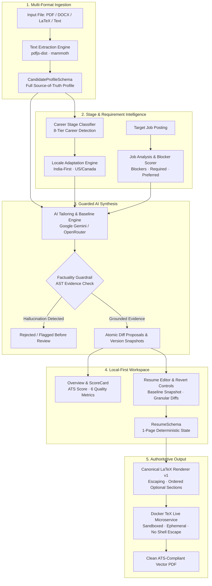

<div align="center">

# ArqeloCV

**AI Resume Builder for Software Engineers**

[](https://arqelo.ashutoshtiwari.dev)
[](https://nextjs.org/)
[](https://react.dev/)
[](https://www.typescriptlang.org/)
[](https://tailwindcss.com/)
[](https://www.docker.com/)
[](https://vitest.dev/)
[](LICENSE)

<p align="center">
  <a href="#-key-features">Features</a> •
  <a href="#-end-to-end-architecture">Architecture</a> •
  <a href="#-quick-start">Quick Start</a> •
  <a href="#-docker-latex-microservice">Docker TeX Engine</a> •
  <a href="#-verification">Verification</a> •
  <a href="#-privacy--security">Privacy</a>
</p>

</div>

---

ArqeloCV is an open-source AI resume builder for software engineers.

Production domain: **[https://arqelo.ashutoshtiwari.dev](https://arqelo.ashutoshtiwari.dev)**

## ⚡ What Makes ArqeloCV Different

Most modern AI resume tools suffer from three fatal flaws: they generate fragile multi-column HTML templates that break Applicant Tracking Systems (ATS), they hallucinate fake technical achievements, and they upload sensitive personal career data to cloud databases.

**ArqeloCV is a compiler-grade, local-first engineering tool:**

1. **Deterministic Single-Column LaTeX**: Structured JSON is the resume source of truth. One versioned canonical template owns typography and layout; AI only proposes validated resume wording.
2. **Zero-Hallucination Factuality Guardrails**: Multi-pass AST token validators prevent the AI from inventing unearned technologies, fabricating metrics (e.g. ungrounded `$2.5M revenue` claims), or altering employers and graduation dates.
3. **Stage & Locale Aware Intelligence**: Tuned for high-volume Indian product & campus hiring (Tier-1/2 project expectations, degree nomenclature) while supporting US & Canadian standards across 8 distinct career stages.
4. **Authoritative Sandboxed TeX Engine**: Compiles real PDF documents using a dedicated containerized TeX Live microservice with shell-escape disabled, disposable temp directories, and scale-to-zero capabilities ($0/mo cost on Cloud Run).
5. **Local-First Privacy Architecture**: Your resume history, imported profiles, and compiled documents reside strictly in your browser's IndexedDB. Zero tracking, zero resume database.

---

## 🏗️ End-to-End Architecture



---

## ✨ Key Features

| Pillar | Capability | Technical Guarantee |
| :--- | :--- | :--- |
| **Factuality Guardrails** | Zero Hallucination Guarantee | AST token validation rejects unearned technologies, fabricated metrics, and altered employment dates before review. |
| **Locale Preference** | India-First & US/Canada Standards | Tuned for Indian tech hiring (degree nomenclature, project rigor) while maintaining North American brevity. |
| **Career Stage Intelligence** | 8 Career Tiers | Detects `Student`, `New Grad`, `Early Career`, `Mid-Level`, `Senior`, `Staff/Principal`, `Career Changer`, and `Returning Professional`. |
| **One-Click Tailoring** | Instant Proposals & Snapshot Restores | Full tailored proposals applied with one click; revert individual changes or restore the baseline at any time. |
| **Dynamic LaTeX Sections** | 7 First-Class Resume Sections | Deterministic rendering for `Summary`, `Experience`, `Projects`, `Skills`, `Education`, `Certifications`, and `Achievements`. |
| **Canonical Template Lock** | One Template, Explicit Override | Generated mode permits only paper size and section order/visibility; manual LaTeX mode is the intentional escape hatch. |
| **Authoritative TeX Sandbox** | Containerized Compilation | Restricted Docker TeX Live engine with `-no-shell-escape`, memory limits, 25s timeout, and disposable build trees. |
| **Local-First Privacy** | Client-Side Storage | IndexedDB persistence with bounded undo/redo history; zero server-side resume logging. |

---

## ⚡ Quick Start

### Prerequisites

- **Node.js**: `v20.x` or later
- **pnpm**: `v10.x` or `v11.x`
- **Docker**: (Optional, required for compiling PDFs locally)

### 1. Clone & Install

```bash
# Clone the repository
git clone https://github.com/iashutoshtiwari/ai-resume-builder.git
cd ai-resume-builder

# Install dependencies
pnpm install
```

### 2. Configure Environment

Copy `.env.example` to `.env.local`:

```bash
cp .env.example .env.local
```

Configure your chosen AI provider (Google Gemini free tier or OpenRouter):

```dotenv
# Provider: 'google' (default) or 'openrouter'
AI_PROVIDER=google

# Google AI Studio (Free Tier available at aistudio.google.com)
GEMINI_API_KEY=your_gemini_api_key_here
GEMINI_MODEL=gemini-3.6-flash

# Dedicated Docker compiler endpoint
LATEX_COMPILER_URL=http://localhost:8080

# OpenRouter (Optional Alternative)
OPENROUTER_API_KEY=your_openrouter_key_here
OPENROUTER_MODEL=google/gemini-2.5-flash
OPENROUTER_MAX_TOKENS=4096
```

> **Note**: No sensitive API keys are exposed to client-side bundles (`server-only` guards all AI routes).

### 3. Run Development Server

```bash
pnpm dev
```

Open [http://localhost:3000](http://localhost:3000) in your browser.

---

## 🐳 Docker LaTeX Microservice

The application uses an authoritative, containerized LaTeX microservice to compile PDFs deterministically. You can run it locally in Docker or deploy it to Google Cloud Run for **$0.00 / month cost**.

### Running the Compiler Locally

```bash
# Build the specialized container image
docker build -t resume-latex-compiler docker/latex-compiler

# Run the container in sandboxed mode on port 8080
docker run -d \
  --read-only \
  --tmpfs /tmp:rw,noexec,nosuid,size=64m \
  -p 8080:8080 \
  --name latex-compiler \
  resume-latex-compiler
```

Verify the health check:

```bash
curl http://localhost:8080/health
# {"status":"ok","timestamp":1725350000000}
```

### Free Deployment on Google Cloud Run ($0/mo)

The microservice is optimized for Google Cloud Run Free Tier:
- **Canonical TeX Dependencies**: Includes the fixed XCharter, microtype, geometry, titlesec, enumitem, and hyperlink dependencies used by the ArqeloCV template.
- **Scale-to-Zero**: `--min-instances 0` ensures zero cost when idle.
- **Fast & Sandboxed**: 1.2s average compile time, non-root `latexuser`, and `-no-shell-escape`.

Detailed 1-command deployment instructions can be found in [`docker/latex-compiler/README.md`](file:///C:/Users/Ashutosh/Documents/GitHub/ai-resume-builder/docker/latex-compiler/README.md).

---

## 🧪 Evaluation Matrix

The codebase includes an automated domain evaluation test suite verifying hiring intelligence and safety constraints:

| Section | Domain Requirement | Test Case | Status |
| :--- | :--- | :--- | :---: |
| **§ 77** | **Exact Technology Matching** | Docker is matched as exact technology | **PASSED** |
| **§ 77** | **Transferable Skill Matching** | GitHub Actions matches CI/CD as transferable/partial | **PASSED** |
| **§ 77** | **Gap Identification** | Missing skills (K8s, Go, AWS, Kafka, Redis) categorized as unsupported gaps | **PASSED** |
| **§ 77** | **Factuality Defense** | AST validator blocks any attempt to fabricate AWS, K8s, or unearned metrics | **PASSED** |
| **§ 78** | **Implied Technology** | Next.js implies React without false product substitution | **PASSED** |
| **§ 78** | **Conceptual Non-Equivalence** | RabbitMQ does not exact-match Kafka | **PASSED** |
| **§ 79** | **Student Career Stage** | Students classified accurately; prioritized for Education & Projects | **PASSED** |
| **§ 79** | **Fair Stage Scoring** | Student project rigor scored without tenure penalties | **PASSED** |
| **§ 80** | **Dynamic TeX Sections** | `Summary`, `Certifications`, `Achievements` rendered cleanly; empty sections omitted | **PASSED** |
| **§ 81** | **Hard Blocker Detection** | Missing mandatory security clearance or YoE flags `Likely Blocked` | **PASSED** |
| **§ 81** | **Scoring Stability** | Deterministic score outputs across repeated runs | **PASSED** |

---

## 💻 Available Commands

```bash
# Start development server
pnpm dev

# Type check with strict TypeScript
pnpm typecheck

# Lint with ESLint
pnpm lint

# Run full Vitest unit & integration test suite (97 tests)
pnpm test

# Run Vitest in interactive watch mode
pnpm test:watch

# Build production bundle
pnpm build

# Run Playwright end-to-end tests
pnpm test:e2e
```

---

## 📂 Project Structure

```
ai-resume-builder/
├── docker/
│   └── latex-compiler/        # Authoritative Docker TeX Live microservice
├── src/
│   ├── app/                   # Next.js 16 App Router pages & API routes
│   │   ├── api/ai/            # parse-resume, analyze-job, tailor, proofread, build-resume
│   │   ├── api/compile/       # Proxy to Docker LaTeX microservice
│   │   └── workspace/         # Main workspace interactive client route
│   ├── components/            # shadcn/ui and Radix UI primitives
│   ├── features/
│   │   ├── assessment/        # Career stage detection, quality scoring, blocker match
│   │   ├── guidance/          # Modular engineering resume knowledge base
│   │   ├── import/            # Multi-format upload & extraction review screen
│   │   ├── jobs/              # Job requirement schemas & analysis models
│   │   ├── latex/             # Canonical template, deterministic renderer & escaping
│   │   ├── presentation/      # Paper size plus section visibility/order allowlist
│   │   ├── resume/            # CandidateProfileSchema & ResumeSchema contracts
│   │   └── workspace/         # Panels, overview, Diff viewer, PDF preview
│   ├── lib/
│   │   ├── ai/                # Factuality validator, prompts, Gemini/OpenRouter drivers
│   │   ├── document/          # Extract text from PDF, DOCX, LaTeX, TXT
│   │   └── storage/           # IndexedDB persistence (idb)
│   └── store/                 # Zustand workspace store with undo/redo & snapshots
├── tests/
│   ├── domain/                # Domain evaluation test suite (Sections 77–81)
│   └── e2e/                   # Playwright visual regression suite
└── main.tex                   # Original standalone compile fixture (not runtime generation)
```

---

## 🔒 Privacy & Security

- **Zero-Storage Philosophy**: We do not store or persist user resumes, prompts, job descriptions, or personal identifiable information on any server database.
- **Client-Side Persistence**: Workspace state and generated PDFs are saved only in the user's browser via IndexedDB.
- **Isolated AI Invocations**: Transmitted text to AI providers (Google Gemini / OpenRouter) occurs solely over encrypted HTTPS per explicit user action.
- **TeX Security Sandbox**: The LaTeX microservice runs with non-root user permissions, `-no-shell-escape`, read-only container root, 64 MB tmpfs limits, and strict per-request cleanup.

---

## 📄 License

This project is open source and available under the [MIT License](LICENSE).
